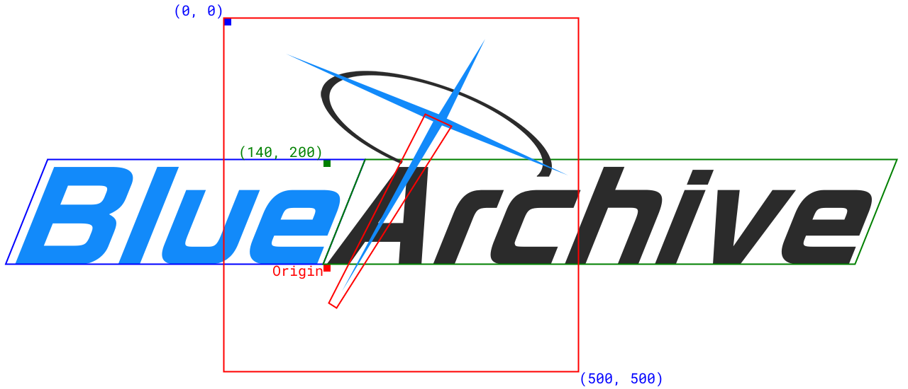

# ba-logo-simple

A logo generator using canvas & REAL vanilla js.

Used assets and magic numbers from [nulla2011](https://github.com/nulla2011/Bluearchive-logo)

Took innovation for blur effect from [appleneko2001](https://github.com/appleneko2001/bluearchive-logo)

Online on [shimamura-sakura.github.io](https://shimamura-sakura.github.io/ba-logo/)

## Used fonts

- RoGSanSrfStd-Bd.otf
- GlowSansSC-Normal-Heavy.otf

Put them in the `assets` folder.

## Usage

```html
<canvas id="canvas" width="1280" height="720"></canvas>
<script src="ba-logo.js"></script>
<script>
  const cvs = document.getElementById("canvas");
  const ctx = cvs.getContext("2d");
  BALogo.load.then(function () {
    const p = baPlanDraw("Blue", "Archive", BALogo.font, 84, 0.4, 0, 0);
    cvs.width = p.w;
    cvs.height = p.h;
    p.draw(ctx, 0, 0, BALogo.colorL, BALogo.colorR);
  });
</script>
```

## Idea

See reference.html


